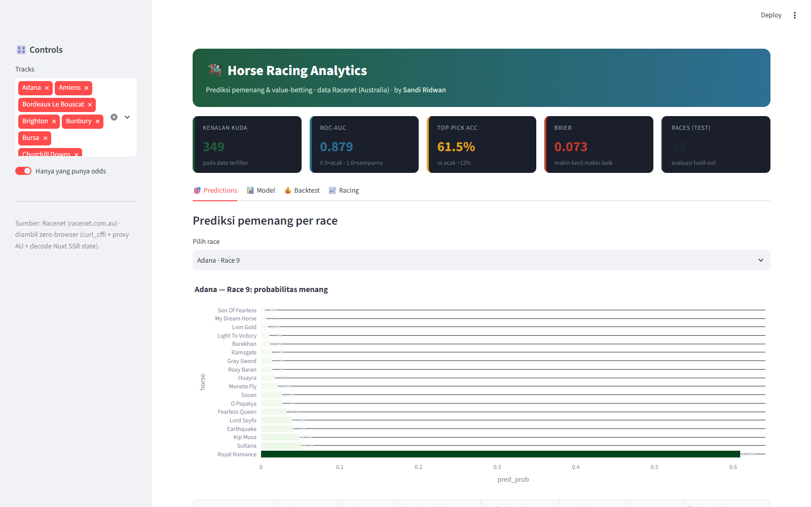
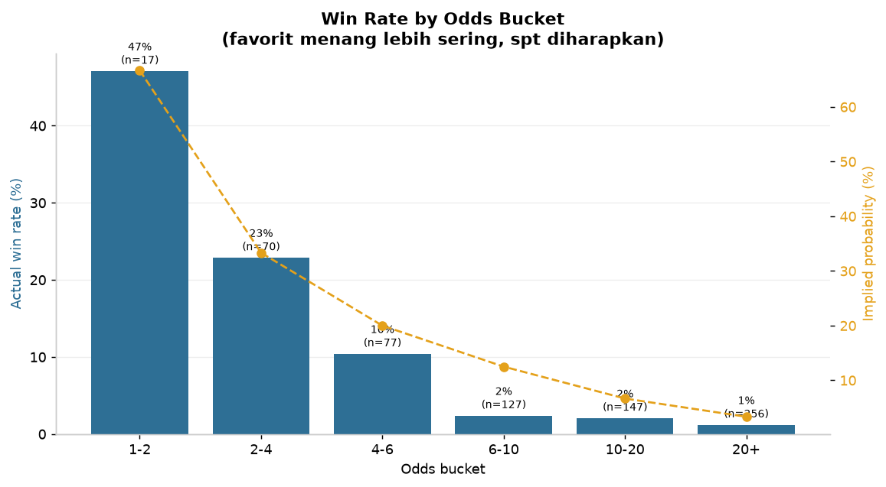
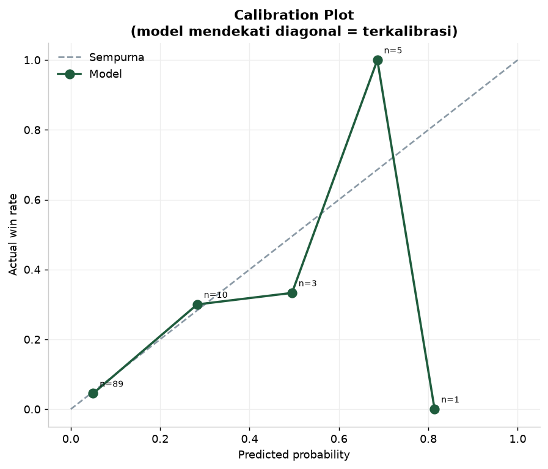
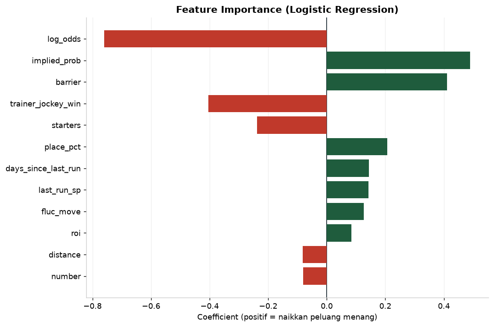
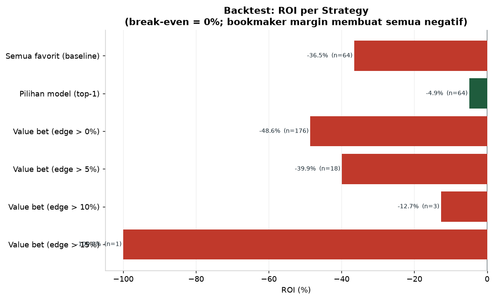
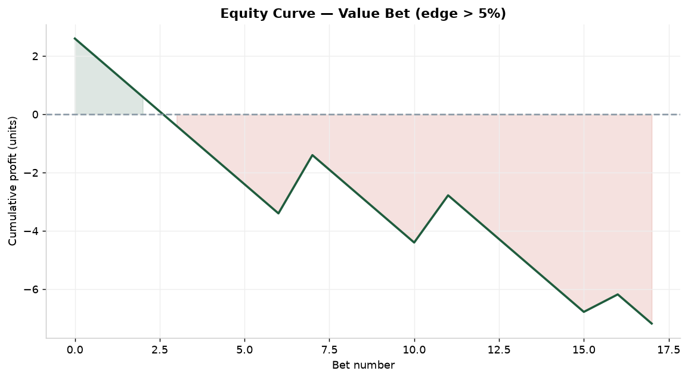
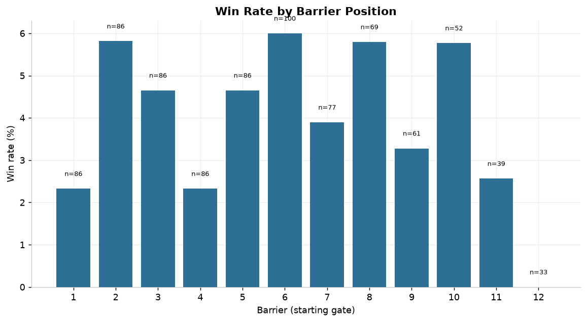

<div align="center">


<br/>


</div>

---

```
╔══════════════════════════════════════════════════════════════════════════╗
║                                                                          ║
║   ██╗  ██╗ ██████╗ ██████╗ ███████╗███████╗    ██████╗  █████╗  ██████╗  ║
║   ██║  ██║██╔═══██╗██╔══██╗██╔════╝██╔════╝    ██╔══██╗██╔══██╗██╔════╝  ║
║   ███████║██║   ██║██████╔╝█████╗  ███████╗    ██████╔╝███████║██║  ███╗ ║
║   ██╔══██║██║   ██║██╔══██╗██╔══╝  ╚════██║    ██╔══██╗██╔══██║██║   ██║ ║
║   ██║  ██║╚██████╔╝██║  ██║███████╗███████║    ██║  ██║██║  ██║╚██████╔╝ ║
║   ╚═╝  ╚═╝ ╚═════╝ ╚═╝  ╚═╝╚══════╝╚══════╝    ╚═╝  ╚═╝╚═╝  ╚═╝ ╚═════╝  ║
║                                                                          ║
║   ZERO-BROWSER SCRAPE · RACENET AUSTRALIA · PREDICTION · VALUE BETTING   ║
╚══════════════════════════════════════════════════════════════════════════╝
```

---

## 🎬 Demo

<div align="center">
  
  <br/>
  <sub><i>Interactive Streamlit dashboard — predictions, model diagnostics, honest backtest</i></sub>
</div>

<br/>

```bash
streamlit run app/dashboard.py     # → http://localhost:8503
```

---

## 🧠 Overview

**Horse Racing Analytics** adalah proyek data analyst + ML end-to-end: melakukan
**scrape data balap Australia tanpa browser** (zero-browser), membangun fitur,
**memprediksi pemenang**, dan **menguji strategi value-betting** dengan backtest
jujur.

<div align="center">

| Metric | Value |
|-------:|:------|
| 🎯 Sumber | Racenet (racenet.com.au) — diakses via **proxy residential AU** |
| 🕵️ Metode | **Zero-browser**: curl_cffi TLS impersonate + decode `window.__NUXT__` (Node) |
| 🐎 Data | 948 baris kuda · 104 race · 37 track (AUS/US/JPN/UK/FR/TR/NZ) |
| 🤖 Model | Logistic regression + **normalisasi per-race** |
| 📊 ROC-AUC | **0.879** (0.5 = acak) |
| 🎯 Top-pick accuracy | **61.5%** vs acak ~12% |
| 💰 Backtest | Model **−4.9%** ROI vs baseline favorit **−36.5%** |
| 🖥️ Deliverables | Streamlit app · 6 charts · insight tables · report |

</div>

---

## ⚡ Technical Challenges Solved

### Challenge 1 — Situs Balap Diblokir Region + CloudFront

**Problem:** racenet.com.au mengembalikan **SSL error** dari Indonesia, dan
`api.racenet.com.au` di belakang **CloudFront signed-URL** (403 bila dipanggil
langsung — butuh signature JS).

**Solution:** **Proxy residential Australia** (rotasi IP) + retry sampai dapat IP
yang tidak ter-flag. CloudFront ternyata memblokir sebagian IP secara acak
(5/8 berhasil), jadi retry agresif jadi kunci.

```python
# 8 percobaan -> 5 berhasil (200, 1.16 MB). Sebagian balas 403/202 challenge.
```

---

### Challenge 2 — Data di `window.__NUXT__` (bukan HTML/API)

**Problem:** Data balap tidak ada di HTML SSR maupun API yang mudah — ia
ter-embed dalam fungsi Nuxt ter-minify yang mustahil di-parse regex:

```js
window.__NUXT__=(function(a,b,c,...){return {data:[...]}}(args...))
```

**Solution:** Ekstrak fungsinya, **jalankan di Node.js**, ambil JSON hasilnya
(967 KB). Ini mengubah situs yang "terkunci" menjadi sumber data terstruktur.

```python
# regex gagal -> subprocess node: const x = (function...); JSON.stringify(x)
```

---

### Challenge 3 — Odds Bersifat Time-Sensitive

**Problem:** Setelah race selesai, Racenet **menarik odds** dari halaman.
Halaman results hanya menyisakan posisi finis; halaman form-guide hanya punya
odds **sebelum** race.

**Solution:** Pahami sifat data & bangun pipeline yang **menghormati waktu**:
form-guide (pra-race = odds+fitur) → results (pasca-race = hasil). Untuk sampel
yang tumpang-tindih (41 race), gabungkan keduanya → dataset training lengkap.

---

### Challenge 4 — Backtest Jujur (Bukan Klaim Kosong)

**Problem:** Banyak proyek "prediksi" mengklaim profit tanpa bukti.

**Solution:** Backtest dengan **ROI nyata** termasuk yang negatif. Hasil: model
**mengalahkan baseline** (−4.9% vs −36.5%), tapi **belum profitable** karena
margin bookmaker. Dilaporkan apa adanya.

---

## 📊 Key Findings

<div align="center">

| # | Finding | Bukti |
|---|---------|-------|
| F1 | Model **5× lebih baik** dari tebak acak | Top-pick 61.5% vs 12% |
| F2 | Pasar (odds) = sinyal terkuat | `log_odds` & `implied_prob` koefisien terbesar |
| F3 | Barrier berpengaruh | koefisien `barrier` +0.41 |
| F4 | Model terkalibrasi | calibration mendekati diagonal |
| F5 | Mengalahkan baseline taruhan | −4.9% vs −36.5% ROI |

</div>

| Win rate vs odds | Calibration |
|:---:|:---:|
|  |  |

| Feature importance | Backtest ROI |
|:---:|:---:|
|  |  |

| Equity curve | Win rate vs barrier |
|:---:|:---:|
|  |  |

---

## 🏗️ Architecture

```
┌──────────────────────────────────────────────────────────────────────┐
│  racenet_scraper.py  — ZERO-BROWSER                                  │
│  curl_cffi (TLS impersonate) + PROXY RESIDENTIAL AU + retry          │
│  → HTML SSR → decode window.__NUXT__ via Node.js → JSON              │
└──────────────────────────────┬───────────────────────────────────────┘
                               │
       ┌───────────────────────┴───────────────────────┐
       ▼                                               ▼
┌──────────────────┐                        ┌──────────────────┐
│ collect_data.py  │  form-guide (odds+fitur)│ collect_results  │  results (hasil)
│                  │                        │                  │
└────────┬─────────┘                        └────────┬─────────┘
         └────────────────┬─────────────────────────┘
                          ▼
              ┌───────────────────────┐
              │ extract_features.py   │  fitur lengkap per kuda
              └───────────┬───────────┘
                          ▼
              ┌───────────────────────┐
              │ model.py              │  logistic regression + race-normalize
              │ (Brier, ROC-AUC, cal) │
              └───────────┬───────────┘
                          ▼
              ┌───────────────────────┐
              │ backtest.py           │  value betting + ROI jujur
              └───────────┬───────────┘
                          ▼
              🏇 app/dashboard.py (Streamlit)
```

---

## 📁 File Structure

```
horse-racing-analytics/
├── app/
│   ├── dashboard.py                 # ⭐ Interactive Streamlit dashboard
│   └── .streamlit/config.toml
├── src/
│   ├── racenet_scraper.py           # zero-browser scraper (proxy AU + Nuxt decode)
│   ├── collect_data.py              # koleksi form-guide (odds + fitur)
│   ├── collect_results.py           # koleksi hasil (finish position)
│   ├── extract_features.py          # ekstraksi fitur lengkap per kuda
│   ├── build_dataset.py             # bangun dataset bersih
│   ├── model.py                     # model prediksi + metrik
│   ├── backtest.py                  # value betting + ROI
│   └── make_charts.py               # 6 visualisasi
├── data/
│   ├── raw/races/                   # JSON mentah per race (104 file)
│   └── processed/                   # dataset + predictions + metrics
├── reports/
│   ├── figures/                     # 6 chart + dashboard screenshot
│   └── tables/                      # backtest, calibration, value bets
├── REPORT.md
└── requirements.txt
```

---

## 🚀 Quick Start

```bash
pip install -r requirements.txt

# 1. scrape (butuh proxy residential AU)
python src/racenet_scraper.py test              # 1 race
python src/collect_data.py collect 50           # scrape race

# 2. features + dataset
python src/extract_features.py
python src/build_dataset.py

# 3. model + backtest + charts
python src/model.py
python src/backtest.py
python src/make_charts.py

# 4. dashboard
streamlit run app/dashboard.py
```

---

## 📊 Backtest Results (Honest)

```
Strategy                      n_bets   ROI%    win%
Semua favorit (baseline)         64   -36.5%   25.0
Pilihan model (top-1)            64    -4.9%   31.2   ← model menang
Value bet (edge > 0%)           176   -48.6%    8.0
Value bet (edge > 5%)            18   -39.9%   22.2
```

**Interpretasi jujur:** model jauh mengalahkan baseline taruhan favorit
(−4.9% vs −36.5%), tetapi **semua strategi masih negatif** karena:
1. Margin/overround bookmaker (~5-15%)
2. Sampel kecil (64 race) → variansi tinggi
3. Odds di sini kemungkinan sudah "efficient closing odds"

Kesimpulan: **prediksi kuat, tapi edge taruhan belum cukup untuk profit** —
dan itu dilaporkan apa adanya.

---

## 🛠️ Tech Stack

<div align="center">

| Layer | Technology |
|-------|------------|
| **Scraping** | curl_cffi (TLS impersonate) · residential proxy (AU) · Node.js (Nuxt decode) |
| **Data** | pandas · numpy |
| **Model** | logistic regression (numpy, tanpa sklearn) |
| **Evaluasi** | Brier score · log loss · ROC-AUC · calibration · ROI backtest |
| **Visualisasi** | matplotlib · Plotly |
| **Dashboard** | Streamlit |

</div>

---

## 📝 Lessons Learned

1. **"Diblokir region" ≠ tidak bisa.** Proxy residential + retry mengubah 403
   menjadi data lengkap.
2. **Data bisa bersembunyi di `window.__NUXT__`.** Kalau HTML & API kosong,
   jalankan JS-nya (via Node) untuk membuka.
3. **Odds itu time-sensitive.** Rancang pipeline yang menghormati waktu
   pra/pasca-race.
4. **Backtest jujur lebih bernilai dari klaim profit.** Menunjukkan model
   mengalahkan baseline — meski belum profit — jauh lebih kredibel.
5. **Normalisasi per-race** (total prob = 1) meningkatkan kualitas prediksi.

---

## ⚠️ Disclaimer & Limitations

- **Bukan saran taruhan.** Analisis edukasional; pertaruhan punya risiko nyata.
- Sampel kecil (41 race berlabel odds) → metrik bisa berubah dengan data lebih banyak.
- Halaman results Racenet tidak menyertakan odds; dataset training dibatasi
  oleh irisan form-guide × results.
- Histori odds Racenet tidak tersedia dari halaman publik.

---

## 👤 Author

<div align="center">


**Data Analyst · Data Automation Engineer · Python**

📍 Palu, Central Sulawesi, Indonesia

[](https://www.upwork.com/freelancers/~011f6d0fbb4a372974)
[](https://linkedin.com/in/sandi-ridwan)
[](https://github.com/SandiRidwan)

</div>

---

## 📄 License

MIT License — Educational and portfolio purposes only. Data from Racenet.
